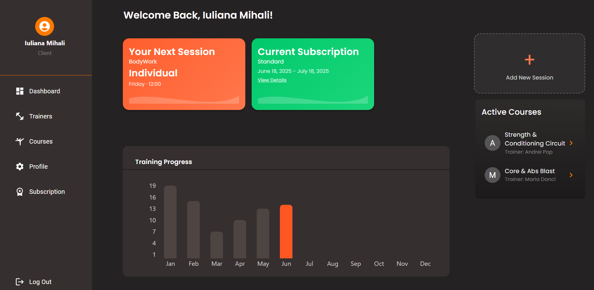

# GymFit - Full-Stack Web Fitness Application
  ## Repositories
- [Frontend Repository](https://github.com/iulianamihali/GymFitFrontend)
- [Backend Repository](https://github.com/iulianamihali/GymFitBackend)

It is designed to simulate a fitness platform where clients can manage their training sessions and subscriptions, while trainers handle schedules, availability, and group courses. **Additionally**, clients can submit reviews only for trainers they are actively enrolled with, ensuring feedback is relevant and experience-based.

The application is built with a **React** (**TypeScript**) frontend and an **ASP.NET Core** backend, using **SQL Server** as the database. Authentication is implemented using **JWT**.

## Preview 
### Client Dashboard

### View Traines 

### View Courses

### Trainer Dashboard

### Trainer – Created Courses

## Features
- Two user roles: **Client** and **Trainer**, each with their own interface and permissions
- Clients can:
  - Subscribe to a plan and track their monthly training progress
  - Book one-on-one training sessions
  - Join group courses with seat limitations
  - Leave reviews only for trainers they are actively enrolled with
- Trainers can:
  - Create and edit their own courses
  - View enrolled clients
  - See monthly statistics of completed training sessions
- Secure login and JWT-based authorization for both clients and trainers

## Technologies Used

- **Frontend**: React with TypeScript, Axios, React Router
- **Backend**: ASP.NET Core, Entity Framework Core
- **Database**: SQL Server
- **Authentication**: JWT (JSON Web Tokens)
- **Tools**: Git, GitHub, Postman, Visual Studio
  
